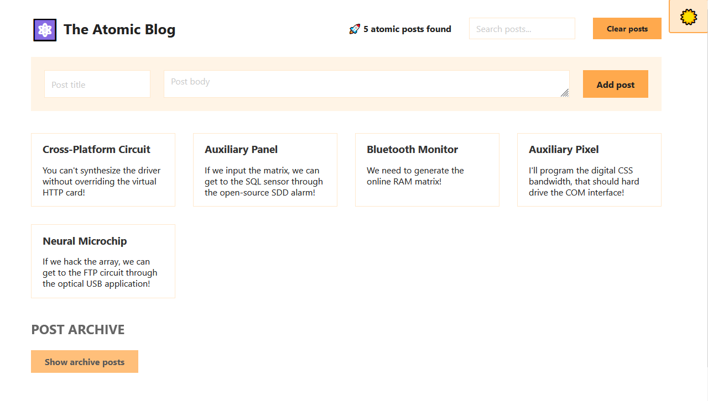

# React - Atomic blog ContextAPI practice

# 🔗 [Live Preview](https://dainty-tiramisu-cf07f7.netlify.app/)

---

## About Project 👋

The Atomic Blog app is a simple React application that generates random posts using the Faker.js library. It allows users to search through posts, toggle a fake dark mode, and interact with posts by adding, clearing, or moving them from an archive.

The app uses React Context to manage and share state across components, making it easy to manage the posts and other app-wide state. Practicing **Context API** was the main purpose of this app.

Created using create-react-app

---

## Features 👨‍💻

-   **Random Post Generation:** Generates random posts using the Faker.js library.

-   **Search Functionality:** Allows users to search through posts by title and body.

-   **Dark Mode Toggle:** Simulates dark mode with a simple toggle button.

-   **Post Archive:** Displays archived posts with the ability to add them as new posts.

-   **Add and Clear Posts:** Users can add new posts and clear all existing posts.

---

## How it works ⚙️

-   **App:** The main component that manages the app's state and provides context to other components.

-   **Header:** Displays the app's title and search functionality.

-   **SearchPosts:** Handles the search input.

-   **Results:** Displays the number of posts found.

-   **Main:** Contains the form to add new posts and displays the list of posts.

-   **FormAddPost:** Handles the addition of new posts.

-   **List:** Displays the list of posts.

-   **Archive:** Manages archived posts and allows adding them as new posts.

-   **Footer:** Displays the app's footer.

---

## Technologies & Dependencies used 📦

- **React:** useEffect, useState, components

- **CSS:** basic styling

- **Context API:** createContext, useContext.

dependencies:

- "@testing-library/jest-dom": "^5.16.5",
- "@testing-library/react": "^13.4.0",
- "@testing-library/user-event": "^13.5.0",
- "react": "^18.2.0",
- "react-dom": "^18.2.0",
- "react-scripts": "5.0.1",
- "web-vitals": "^2.1.4"

devDependencies:

- "@faker-js/faker": "^7.6.0"

---

## Prerequisites 📚

Ensure you have the following installed on your system:

    Node.js v18.00.0
    npm or yarn

---

## Clone & Run locally 🏃‍♂️

1. **Clone the Repository:**

   - On the GitHub repo page, click the green "Code" button.

   - Copy the HTTPS URL.

2. **Open the Terminal:**

   - Open the terminal by typing "cmd" in your desktop's start menu, **OR**

   - Right-click on the desktop and select "Git Bash Here" (if you have Git Bash installed), **OR**

   - Open Visual Studio Code's terminal by clicking "Terminal" -> "New Terminal" inside the editor.

3. **Navigate to Your Project Location:**

   - In the terminal, navigate to your desired location (e.g., desktop) using the command: `cd desktop`. Adjust the path if your project is located elsewhere.

   - Ensure that your terminal's address is inside the project folder.

4. **Clone the Repository:**

   - Run the command: `git clone /link/`. Replace `/link/` with the HTTPS URL from step 1.

5. **Enter the Project Directory:**

   - Navigate into the cloned repository by typing: `cd /folder-name/`. Replace `/folder-name/` with the name of the cloned folder.

6. **Install Dependencies:**

   - Run the command: `npm install` to install all the necessary dependencies.

7. **Start the Project:**

   - Run the command: `npm start` or `yarn start` to start the project. It will open in your default browser at [localhost:3000/](http://localhost:3000/)

---

## Project Structure 📂

    ├── public
    ├── src
    │ ├── App.js
    │ ├── index.js
    │ ├── style.css
    │ ├── Test.js
    ├── package.json 
    └── README.md 

---

## Contributing 💻

Contributions are closed at the moment.

---
